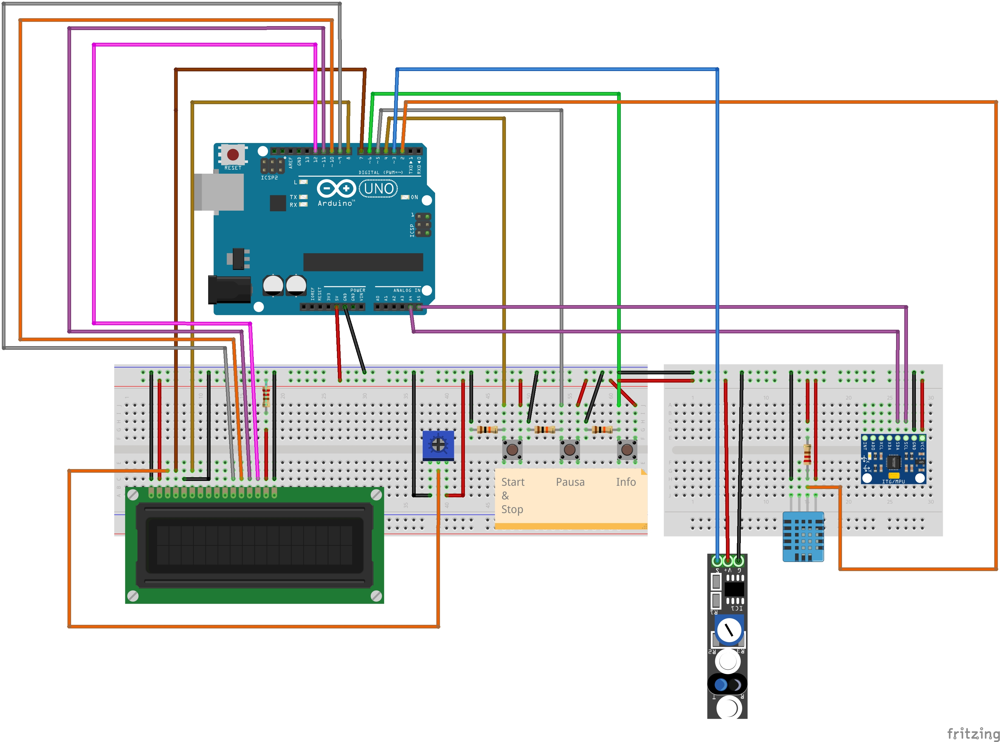
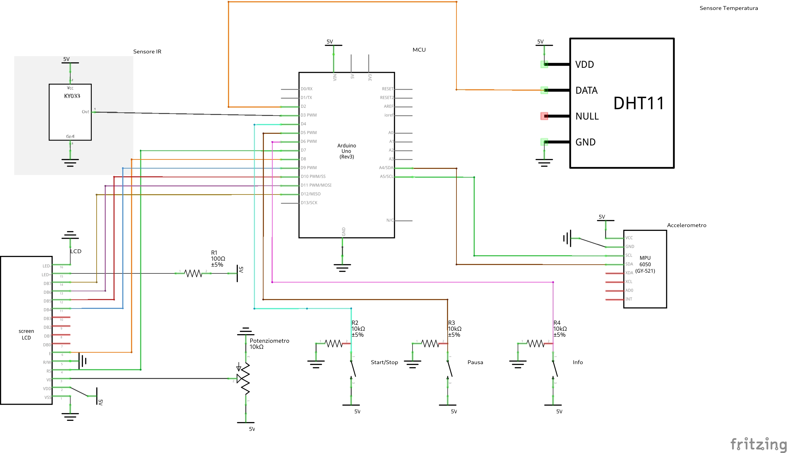
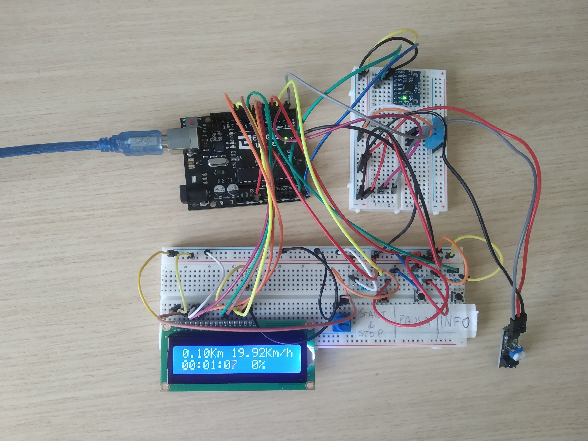
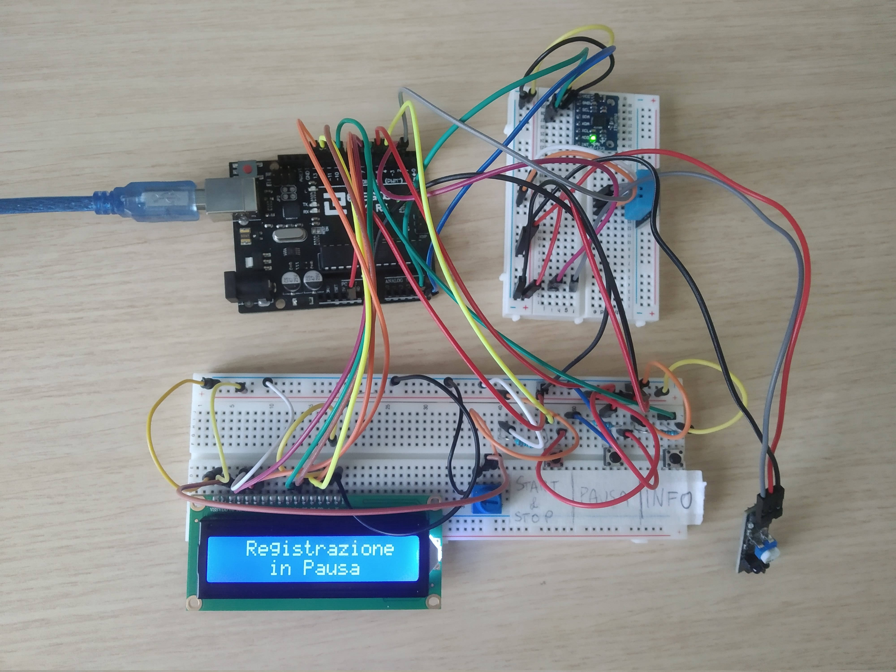
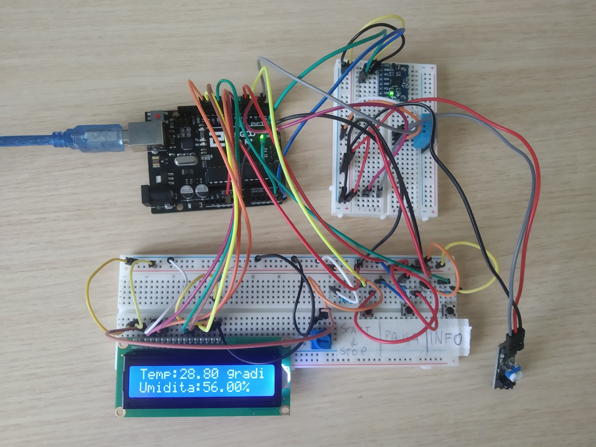

# Ciclocomputerino

### Autori:
Simone Spreafico

### Descrizione:

Il progetto proposto vuole realizzare un ciclocomputer con un microcontrollore che visualizzi su un display lcd vari valori relativi ad un giro di allenamento in bicicletta, come la velocità della bici, il tempo trascorso dall'inizio dell'allenamento e la distanza percorsa. Il ciclocomputer è provvisto anche di un accelerometro che rileva il cambio di pendenza del percorso e di un sensore di temperatura che rileva temperaturà e umidità dell'ambiente in cui ci si trova.

### Elenco componenti utilizzati all'interno del progetto:

- 1 Elegoo UNO R3
- 1 Display LCD 1602
- 1 Sensore Tracking IR (KY-033)
- 1 Modulo GY-521 (accelerometro)
- 1 Sensore DHT11 (temperatura e umidità)
- 1 Potenziometro da 10 kΩ
- 1 Breadboard 830 punti
- 1 Breadboard 400 punti
- 3 Pulsanti
- Resistenze (10kΩ e 100Ω)
- Cavetti dupont

### Librerie software utilizzate
- [LiquidCrystal](https://github.com/arduino-libraries/LiquidCrystal)
- [Adafruit Sensor](https://github.com/adafruit/Adafruit_Sensor)
- [Bounce2](https://github.com/thomasfredericks/Bounce2)
- [DHT Sensor Library](https://github.com/adafruit/DHT-sensor-library)
- [MPU6050](https://github.com/electroniccats/mpu6050)

### Schema

### Schema Elettrico

### Immagini Prototipo

#### Schermata Avvio
Schermata visualizzata al primo avvio del ciclocomputer

#### Schermata Principale
Nella prima riga del display LCD vengono mostrate distanza percorsa in kilometri
e velocità in kilometri orari. Nella seconda riga viene mostrato un cronometro che 
registra il tempo trascorso dell'allenamento e la pendenza del percorso espressa
come percentuale.

#### Schermata Pausa
Se premuto il pulsante di pausa, il ciclocomputer va in uno stato di pausa dove 
non registra i valori di allenamento e interrompe il cronometro.

#### Schermata Informazioni Aggiuntive
In questa schermata vengono mostrati i dati rilevati dal sensore DHT11 ovvero 
temperatura in gradi e umidità espressa in percentuale.

### Licenza
GNU GENERAL PUBLIC LICENSE version 3 (GPLv3)

